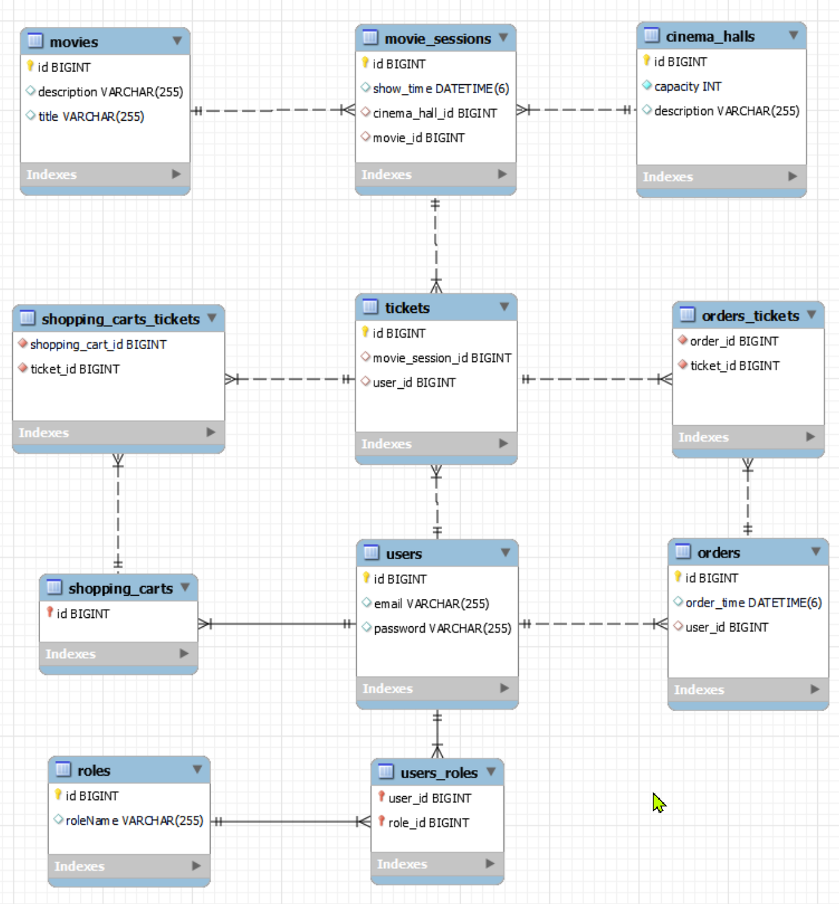

# Cinema shop

## Project description
This application simulates cinema's ticket-reservation system and has nex features:
- Register a new user
- Login
- Authorization based on roles
- CRUD operations, which you can check on the next endpoints:
<pre>
[POST]   /register - registers a new user
[POST]   /movies - creates a new movie
[GET]    /movies - returns all movies
[POST]   /cinema-halls - creates a new cinema hall
[GET]    /cinema-halls - returns all cinema halls
[POST]   /movie-sessions - creates a new movie session
[GET]    /movie-sessions/available - returns all available movie sessions for the selected movie
[PUT]    /movie-sessions/{id} - updates a movie session
[DELETE] /movie-sessions/{id} - deletes a movie session
[PUT]    /shopping-carts/movie-sessions - adds a movie session to shopping cart of logged user
[GET]    /shopping-carts/by-user - returns shopping cart of logged user
[POST]   /orders/complete - completes an order of logged user
[GET]    /orders - returns order history of logged user
[GET]    /users/by-email - returns user by email
</pre>

Endpoints send and receive JSON data.
Different endpoints have different security options and accessed based on roles. 

When app is started it adds user admin@i.ua with default password and role ADMIN.

## Project architecture
1. Controllers - Presentation layer
2. Services - Application layer
3. DAO - Data access layer

## Database structure

# Technologies used in project
- Java v.11
- Apache Maven v.3.8
- MySQL v.8
- Spring Core
- Spring MVC
- Spring Security
- Hibernate v.5

## How to run a project?
1. Clone this project
2. Install and configure MySQL
3. Open project in IntelliJ IDEA
4. Setup database parameters in `src/main/resources/db.properties`
5. After that you can start application and login via browser http://localhost:8080 (admin/1234)
6. Via http://localhost:8080/register you can register new user
